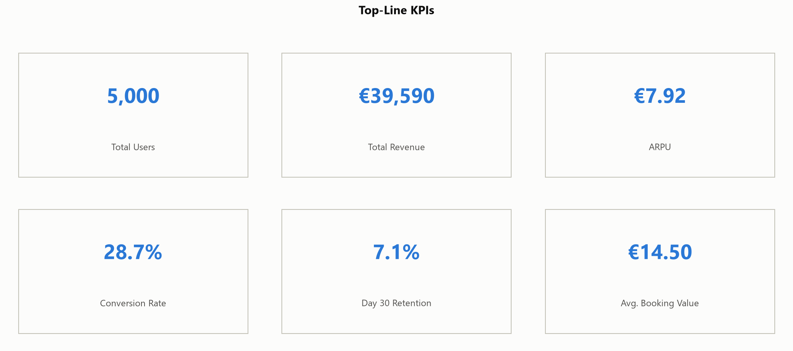
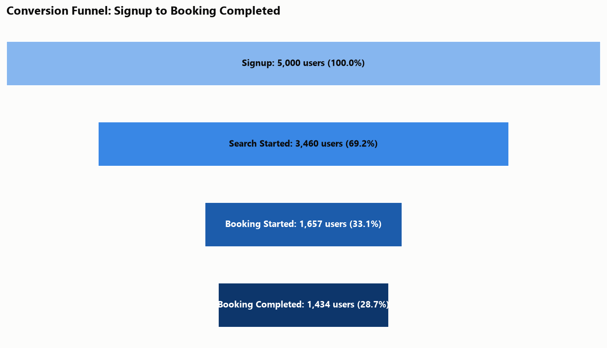
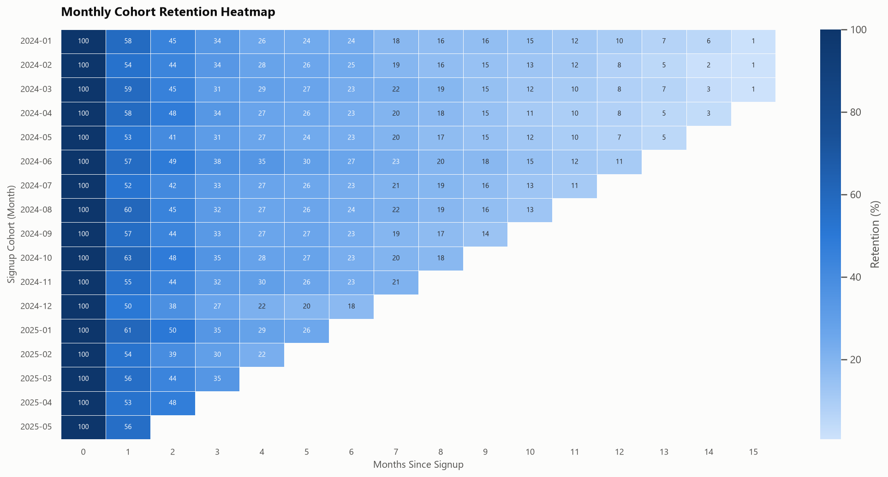
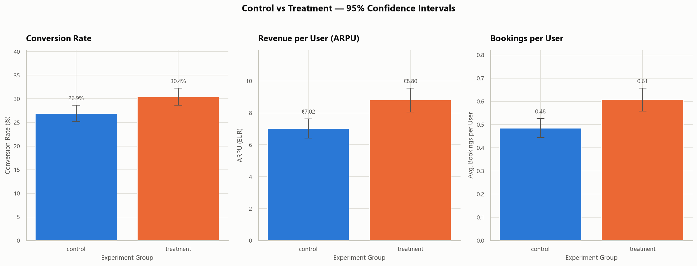

# Product Analytics Case Study
## User Retention, Funnel Analytics, Feature Adoption & A/B Testing

An end-to-end Product Analytics portfolio project that simulates a real-world European mobility platform and demonstrates how behavioural event data can be transformed into actionable business decisions using Python, SQL, SQLite, statistical analysis, and data visualisation.

The project follows a complete analytics workflow similar to modern product organisations, covering data generation, validation, SQL analytics, exploratory data analysis, experimentation, and executive-level business recommendations.

The analysis focuses on:

- User activation and conversion
- Product funnel performance and drop-off
- Day 1, Day 7, and Day 30 retention
- Monthly cohort behaviour
- Feature adoption
- Customer segmentation
- A/B testing
- Executive business recommendations

> **Note:** All datasets are synthetic and contain no personally identifiable information.

---

# Project Preview

<table>
<tr>
<td width="50%">

</td>
<td width="50%">

</td>
</tr>

<tr>
<td width="50%">

</td>
<td width="50%">

</td>
</tr>
</table>

---

# Project Snapshot

| Metric | Result |
|---|---:|
| Users | 5,000 |
| Behavioural Events | 141,813 |
| Completed Bookings | 2,731 |
| Total Simulated Revenue | €39,589.80 |
| Data Period | January 2024 – June 2025 |
| Validation Checks | 23 Passed |
| Automated Tests | 25 Passed |
| Control Conversion Rate | 26.9% |
| Treatment Conversion Rate | 30.5% |
| Experiment Uplift | +3.6 percentage points |

---

# Business Problem

A fictional European mobility platform wants to answer the following business questions:

1. Where do users abandon the booking funnel?
2. Which acquisition channels deliver the highest-quality users?
3. Which platforms perform best?
4. Which product features improve retention?
5. How does user behaviour evolve across cohorts?
6. Does a simplified booking flow improve conversion?
7. Which product initiatives should be prioritised?

---

# Key Findings

## Acquisition Quality

Referral users produced the highest-quality traffic.

- ~40.0% conversion
- ~10.9% activation within seven days

Paid Search produced substantially weaker users.

- ~23.5% conversion
- ~5.0% activation

**Business Insight**

Acquisition volume alone should never determine marketing investment. Referral users consistently generated higher downstream business value.

---

## Platform Performance

Conversion rates:

- iOS ≈ 30.0%
- Android ≈ 28.8%
- Web ≈ 24.0%

**Business Insight**

The Web booking journey should be prioritised for UX investigation and optimisation.

---

## Feature Adoption

Users enabling notifications and favourite locations demonstrated longer engagement.

**Business Insight**

The relationship is observational rather than causal and should be validated through controlled experimentation.

---

## Experiment Performance

The **simplified_booking_flow** experiment increased conversion from **26.9%** to **30.5%**, representing an uplift of approximately **3.6 percentage points**.

The analysis includes:

- Statistical significance testing
- 95% confidence intervals
- Revenue comparison
- Booking-rate comparison

---

# Exploratory Data Analysis (Phase 3)

Phase 3 extends the SQL analytics layer with a production-style Python exploratory analysis workflow consisting of six dedicated notebooks.

The notebooks analyse the raw behavioural datasets directly using:

- Pandas
- NumPy
- Matplotlib
- Seaborn
- SciPy

Every analytical section follows the same professional structure:

> **Business Question → Analysis → Visualisation → Business Insight → Recommendation**

## Notebooks

| Notebook | Description |
|---|---|
| `01_data_overview.ipynb` | Dataset overview, schema validation, descriptive statistics, correlations |
| `02_user_behaviour.ipynb` | User segmentation by country, platform, acquisition channel, age group and device |
| `03_retention_analysis.ipynb` | D1 / D7 / D30 retention, cohort analysis, retention curves and heatmaps |
| `04_funnel_analysis.ipynb` | Funnel conversion, abandonment analysis and optimisation opportunities |
| `05_ab_testing.ipynb` | Experiment evaluation using confidence intervals and statistical testing |
| `06_executive_summary.ipynb` | Executive dashboard, KPI summary and prioritised product recommendations |

Every important figure is exported as a standalone PNG into the `images/` folder.

---

# Business Recommendations

1. Optimise the Web booking journey.
2. Scale Referral acquisition while monitoring user quality.
3. Improve Paid Search targeting and landing pages.
4. Increase feature adoption through contextual prompts.
5. Continue monitoring the booking-flow experiment before full rollout.
6. Monitor KPIs by platform and acquisition channel.
7. Validate behavioural insights through future experiments.

Detailed findings are available in:

- `insights/phase2_summary.md`
- `notebooks/`

---

# Technical Stack

## Programming & Analytics

- Python
- SQL
- SQLite
- Pandas
- NumPy
- SciPy

## Data Visualisation

- Matplotlib
- Seaborn

## Product Analytics

- KPI Reporting
- Funnel Analysis
- Cohort Analysis
- Retention Analysis
- Customer Segmentation
- Feature Adoption
- A/B Testing
- Statistical Significance Testing

## Engineering & Quality

- Automated Data Validation
- Pytest
- Git
- GitHub

## Business Intelligence

- Power BI *(Phase 4 – Planned)*

---

# Repository Structure

```text
product-analytics-retention/
├── README.md
├── requirements.txt
├── data/
│   ├── raw/
│   ├── processed/
│   └── README.md
├── src/
│   ├── generate_data.py
│   ├── validate_data.py
│   ├── build_database.py
│   ├── run_sql.py
│   └── eda_utils.py
├── sql/
├── notebooks/
│   ├── 01_data_overview.ipynb
│   ├── 02_user_behaviour.ipynb
│   ├── 03_retention_analysis.ipynb
│   ├── 04_funnel_analysis.ipynb
│   ├── 05_ab_testing.ipynb
│   └── 06_executive_summary.ipynb
├── images/
├── insights/
├── dashboard/
└── tests/
```

---

# Future Improvements

- Interactive Power BI Executive Dashboard
- Executive Presentation Deck
- Product KPI Monitoring Dashboard
- Additional Product Experimentation Case Studies
- Product Analytics Technical Blog
- Cloud Deployment of Analytics Assets

---

# Key Skills Demonstrated

- Product Analytics
- Business Analytics
- SQL
- Python
- Exploratory Data Analysis (EDA)
- Data Validation
- KPI Reporting
- Dashboard Design
- Funnel Analysis
- Cohort Analysis
- Retention Analysis
- Customer Segmentation
- A/B Testing
- Statistical Analysis
- Business Storytelling
- Executive Reporting

---

# Author

**Sara Hosseini**

Business & Data Analyst

Berlin, Germany

- LinkedIn: https://www.linkedin.com/in/sara-hosseini-a22353267/
- Portfolio: https://sara-hosseini.github.io
- GitHub: https://github.com/Sara-Hosseini

⭐ Feel free to explore the project and connect with me.